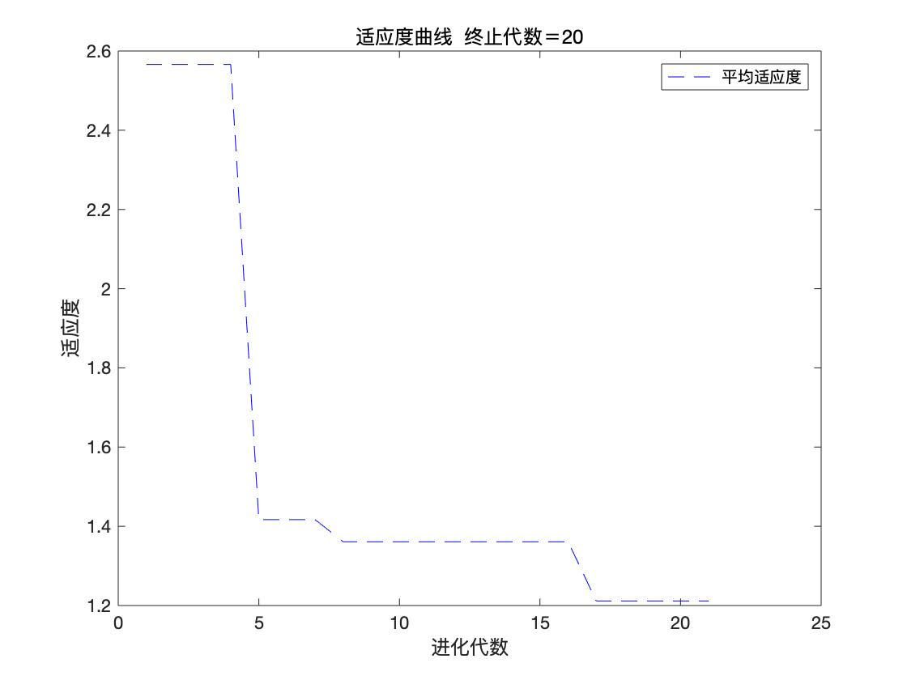
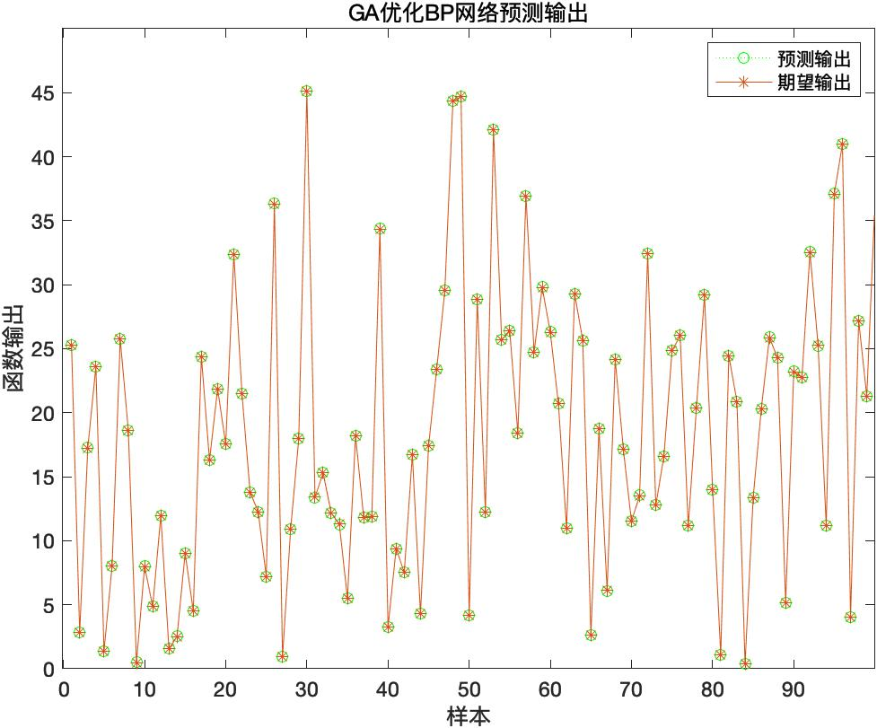
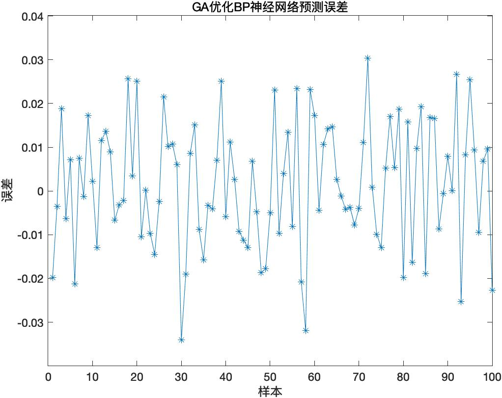
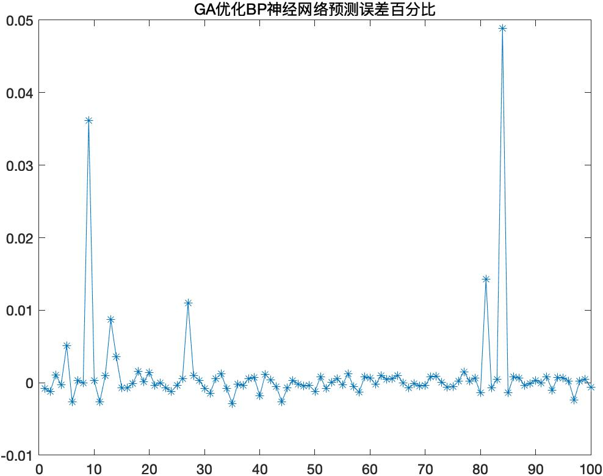

## 03 BP遗传算法优化-非线性函数拟合

### 1.遗传算法原理
遗传算法就是在引入优化参数形成的编码串联群体中，按照所选择的 **适应度函数** 并通过遗传中的 **选择、交叉和变异** 对个体进行筛选，使适应度值高的个体被保留，适应度差的个体被淘汰。

新的群体既继承了上一代的信息，又优于上一代。

这样反复循环，直至满足条件。

### 2.遗传算法基本步骤
遗传算法基本的操作分为：选择、交叉和变异操作三个步骤。

选择操作是指从旧群体中以一定概率选择个体到新群体中，个体被选中的概率跟适应度值有关，个体适应度值越好，被选中的概率越大。

**交叉操作:**是指从个体中选择两个个体，通过两个染色体的交换组合，来产生新的优秀个体。交叉过程为从群体中任选两个染色体，随机选择一点或多点染色体位置进行交换。

**变异操作:**是指从群体中任选一个个体，选择染色体中的一点进行变异以产生更优秀的个体。

### 3.进行遗传算法所需的要素
1. 初始化参数：
主要包括群体大小M、遗传代数G、交叉概率Pc和变异概率Pm。
2. 染色体编码方法：
- 实数法：把个体编码成一个实数串
- 二进制法：把个体编码成二进制串
3. 适应度函数：根据进化目标编写的计算个体适应度值的函数，通过适应度函数计算每个个体的适应度值，提供给选择算子进行选择。
4. 遗传操作：指选择、交叉和变异操作。

### 4.拟合的函数

### 5.具体实现
要拟合的非线性函数有2个输入参数、1个输出参数，所以设置的BP神经网络结构为2-5-1，即输入层有2个节点，隐含层有5个节点，输出层有1个节点，共有2×5+5×1=15个权值，5+1=6个阈值，所以遗传算法个体的编码长度为15+6=21。

#### 5.1 数据的读取和节点设置

~~~MATLAB
%读取数据
load data input output

%节点个数
inputnum=2;
hiddennum=5;
outputnum=1;
~~~
#### 5.2 输入输出的设置和网络设置

从非线性函数中随机得到2000组输入输出数据，从中随机选择1 900组作为训练数据，用于网络训练，100组作为测试数据。

~~~MATLAB
%训练数据和预测数据
input_train=input(1:1900,:)';
input_test=input(1901:2000,:)';
output_train=output(1:1900)';
output_test=output(1901:2000)';

%选连样本输入输出数据归一化
[inputn,inputps]=mapminmax(input_train);
[outputn,outputps]=mapminmax(output_train);

%构建网络
net=newff(inputn,outputn,hiddennum);
~~~
#### 5.3 遗传算法参数初始化

~~~matlab
maxgen=20;                         %进化代数，即迭代次数
sizepop=10;                        %种群规模
pcross=[0.2];                       %交叉概率选择，0和1之间
pmutation=[0.1];                    %变异概率选择，0和1之间

%节点总数
numsum=inputnum*hiddennum+hiddennum+hiddennum*outputnum+outputnum;

lenchrom=ones(1,numsum);        
bound=[-3*ones(numsum,1) 3*ones(numsum,1)];    %数据范围
~~~

#### 5.4 种群初始化

~~~matlab
individuals=struct('fitness',zeros(1,sizepop), 'chrom',[]);  %将种群信息定义为一个结构体
avgfitness=[];                      %每一代种群的平均适应度
bestfitness=[];                     %每一代种群的最佳适应度
bestchrom=[];                       %适应度最好的染色体
%初始化种群
for i=1:sizepop
    %随机产生一个种群
    individuals.chrom(i,:)=Code(lenchrom,bound);    %编码（binary和grey的编码结果为一个实数，float的编码结果为一个实数向量）
    x=individuals.chrom(i,:);
    %计算适应度
    individuals.fitness(i)=fun(x,inputnum,hiddennum,outputnum,net,inputn,outputn);   %染色体的适应度
end
FitRecord=[];
%找最好的染色体
[bestfitness bestindex]=min(individuals.fitness);
bestchrom=individuals.chrom(bestindex,:);  %最好的染色体
avgfitness=sum(individuals.fitness)/sizepop; %染色体的平均适应度
% 记录每一代进化中最好的适应度和平均适应度
trace=[avgfitness bestfitness];
~~~

##### 5.4.1 Code.m文件：将变量编码成染色体

~~~MATLAB
function ret=Code(lenchrom,bound)
%本函数将变量编码成染色体，用于随机初始化一个种群
% lenchrom   input : 染色体长度
% bound      input : 变量的取值范围
% ret        output: 染色体的编码值
flag=0;
while flag==0
    pick=rand(1,length(lenchrom));
    ret=bound(:,1)'+(bound(:,2)-bound(:,1))'.*pick; %线性插值，编码结果以实数向量存入ret中
    flag=test(lenchrom,bound,ret);     %检验染色体的可行性
end
~~~

##### 5.4.2 fun.m文件：适应度函数

把训练数据预测误差绝对值之和作为个体适应度值，个体适应度值越小，该个体越优。

~~~matlab
function error = fun(x,inputnum,hiddennum,outputnum,net,inputn,outputn)
%该函数用来计算适应度值
%x          input     个体
%inputnum   input     输入层节点数
%outputnum  input     隐含层节点数
%net        input     网络
%inputn     input     训练输入数据
%outputn    input     训练输出数据

%error      output    个体适应度值

%提取
w1=x(1:inputnum*hiddennum);
B1=x(inputnum*hiddennum+1:inputnum*hiddennum+hiddennum);
w2=x(inputnum*hiddennum+hiddennum+1:inputnum*hiddennum+hiddennum+hiddennum*outputnum);
B2=x(inputnum*hiddennum+hiddennum+hiddennum*outputnum+1:inputnum*hiddennum+hiddennum+hiddennum*outputnum+outputnum);

%网络进化参数
net.trainParam.epochs=20;
net.trainParam.lr=0.1;
net.trainParam.goal=0.00001;
net.trainParam.show=100;
net.trainParam.showWindow=0;
 
%网络权值赋值
net.iw{1,1}=reshape(w1,hiddennum,inputnum);
net.lw{2,1}=reshape(w2,outputnum,hiddennum);
net.b{1}=reshape(B1,hiddennum,1);
net.b{2}=B2;

%网络训练
net=train(net,inputn,outputn);

an=sim(net,inputn);

error=sum(abs(an-outputn));
~~~

#### 5.5 迭代求解最佳初始阈值和权值

~~~matlab
for i=1:maxgen
    % 选择
    individuals=Select(individuals,sizepop); 
    avgfitness=sum(individuals.fitness)/sizepop;
    %交叉
    individuals.chrom=Cross(pcross,lenchrom,individuals.chrom,sizepop,bound);
    % 变异
    individuals.chrom=Mutation(pmutation,lenchrom,individuals.chrom,sizepop,i,maxgen,bound);
    
    % 计算适应度 
    for j=1:sizepop
        x=individuals.chrom(j,:); %解码
        individuals.fitness(j)=fun(x,inputnum,hiddennum,outputnum,net,inputn,outputn);   
    end
    
  %找到最小和最大适应度的染色体及它们在种群中的位置
    [newbestfitness,newbestindex]=min(individuals.fitness);
    [worestfitness,worestindex]=max(individuals.fitness);
    % 代替上一次进化中最好的染色体
    if bestfitness>newbestfitness
        bestfitness=newbestfitness;
        bestchrom=individuals.chrom(newbestindex,:);
    end
    individuals.chrom(worestindex,:)=bestchrom;
    individuals.fitness(worestindex)=bestfitness;
    
    avgfitness=sum(individuals.fitness)/sizepop;
    
    trace=[trace;avgfitness bestfitness]; %记录每一代进化中最好的适应度和平均适应度
    FitRecord=[FitRecord;individuals.fitness];
end
~~~

##### 5.5.1 Select.m：选择函数

~~~matlab
function ret=select(individuals,sizepop)
% 本函数对每一代种群中的染色体进行选择，以进行后面的交叉和变异
% individuals input  : 种群信息
% sizepop     input  : 种群规模
% ret         output : 经过选择后的种群

%根据个体适应度值进行排序
fitness1=10./individuals.fitness;

sumfitness=sum(fitness1);
sumf=fitness1./sumfitness;
index=[]; 
for i=1:sizepop   %转sizepop次轮盘
    pick=rand;
    while pick==0    
        pick=rand;        
    end
    for j=1:sizepop    
        pick=pick-sumf(j);        
        if pick<0        
            index=[index j];            
            break;  %寻找落入的区间，此次转轮盘选中了染色体i，注意：在转sizepop次轮盘的过程中，有可能会重复选择某些染色体
        end
    end
end
individuals.chrom=individuals.chrom(index,:);
individuals.fitness=individuals.fitness(index);
ret=individuals;
~~~

##### 5.5.2 Cross.m：交叉函数

~~~matlab
function ret=Cross(pcross,lenchrom,chrom,sizepop,bound)
%本函数完成交叉操作
% pcorss                input  : 交叉概率
% lenchrom              input  : 染色体的长度
% chrom     input  : 染色体群
% sizepop               input  : 种群规模
% ret                   output : 交叉后的染色体
 for i=1:sizepop  %每一轮for循环中，可能会进行一次交叉操作，染色体是随机选择的，交叉位置也是随机选择的，%但该轮for循环中是否进行交叉操作则由交叉概率决定（continue控制）
     % 随机选择两个染色体进行交叉
     pick=rand(1,2);
     while prod(pick)==0
         pick=rand(1,2);
     end
     index=ceil(pick.*sizepop);
     % 交叉概率决定是否进行交叉
     pick=rand;
     while pick==0
         pick=rand;
     end
     if pick>pcross
         continue;
     end
     flag=0;
     while flag==0
         % 随机选择交叉位
         pick=rand;
         while pick==0
             pick=rand;
         end
         pos=ceil(pick.*sum(lenchrom)); %随机选择进行交叉的位置，即选择第几个变量进行交叉，注意：两个染色体交叉的位置相同
         pick=rand; %交叉开始
         v1=chrom(index(1),pos);
         v2=chrom(index(2),pos);
         chrom(index(1),pos)=pick*v2+(1-pick)*v1;
         chrom(index(2),pos)=pick*v1+(1-pick)*v2; %交叉结束
         flag1=test(lenchrom,bound,chrom(index(1),:));  %检验染色体1的可行性
         flag2=test(lenchrom,bound,chrom(index(2),:));  %检验染色体2的可行性
         if   flag1*flag2==0
             flag=0;
         else flag=1;
         end    %如果两个染色体不是都可行，则重新交叉
     end
 end
ret=chrom;
~~~

##### 5.5.3 Mutation.m：变异函数

~~~matlab
function ret=Mutation(pmutation,lenchrom,chrom,sizepop,num,maxgen,bound)
% 本函数完成变异操作
% pcorss                input  : 变异概率
% lenchrom              input  : 染色体长度
% chrom     input  : 染色体群
% sizepop               input  : 种群规模
% opts                  input  : 变异方法的选择
% pop                   input  : 当前种群的进化代数和最大的进化代数信息
% bound                 input  : 每个个体的上届和下届
% maxgen                input  ：最大迭代次数
% num                   input  : 当前迭代次数
% ret                   output : 变异后的染色体

for i=1:sizepop   %每一轮for循环中，可能会进行一次变异操作，染色体是随机选择的，变异位置也是随机选择的，
    %但该轮for循环中是否进行变异操作则由变异概率决定（continue控制）
    % 随机选择一个染色体进行变异
    pick=rand;
    while pick==0
        pick=rand;
    end
    index=ceil(pick*sizepop);
    % 变异概率决定该轮循环是否进行变异
    pick=rand;
    if pick>pmutation
        continue;
    end
    flag=0;
    while flag==0
        % 变异位置
        pick=rand;
        while pick==0      
            pick=rand;
        end
        pos=ceil(pick*sum(lenchrom));  %随机选择了染色体变异的位置，即选择了第pos个变量进行变异
    
        pick=rand; %变异开始     
        fg=(rand*(1-num/maxgen))^2;
        if pick>0.5
            chrom(i,pos)=chrom(i,pos)+(bound(pos,2)-chrom(i,pos))*fg;
        else
            chrom(i,pos)=chrom(i,pos)-(chrom(i,pos)-bound(pos,1))*fg;
        end   %变异结束
        flag=test(lenchrom,bound,chrom(i,:));     %检验染色体的可行性
    end
end
ret=chrom;
~~~

### 6.结果分析

#### 6.1 适应度曲线

~~~matlab
figure(1)
[r c]=size(trace);
plot([1:r]',trace(:,2),'b--');
title(['适应度曲线  ' '终止代数＝' num2str(maxgen)]);
xlabel('进化代数');ylabel('适应度');
legend('平均适应度');
~~~

#### 6.2 把最优初始阀值权值赋予网络预测

用遗传算法优化的BP网络进行值预测

~~~matlab
w1=x(1:inputnum*hiddennum);
B1=x(inputnum*hiddennum+1:inputnum*hiddennum+hiddennum);
w2=x(inputnum*hiddennum+hiddennum+1:inputnum*hiddennum+hiddennum+hiddennum*outputnum);
B2=x(inputnum*hiddennum+hiddennum+hiddennum*outputnum+1:inputnum*hiddennum+hiddennum+hiddennum*outputnum+outputnum);

net.iw{1,1}=reshape(w1,hiddennum,inputnum);
net.lw{2,1}=reshape(w2,outputnum,hiddennum);
net.b{1}=reshape(B1,hiddennum,1);
net.b{2}=B2;
~~~

#### 6.3 BP网络训练

~~~matlab
%网络进化参数
net.trainParam.epochs=100;
net.trainParam.lr=0.1;
%net.trainParam.goal=0.00001;

%网络训练
[net,per2]=train(net,inputn,outputn);
~~~

#### 6.4 BP网络预测

~~~matlab
%数据归一化
inputn_test=mapminmax('apply',input_test,inputps);
an=sim(net,inputn_test);
test_simu=mapminmax('reverse',an,outputps);
error=test_simu-output_test;
~~~

#### 6.5 GA优化BP网络预测结果分析

##### 6.5.1 GA优化BP网络预测输出

~~~matlab
figure(2)
plot(test_simu,':og')
hold on
plot(output_test,'-*');
legend('预测输出','期望输出')
title('GA优化BP网络预测输出','fontsize',12)
ylabel('函数输出','fontsize',12)
xlabel('样本','fontsize',12)
~~~

##### 6.5.2：预测误差

~~~ matlab
%预测误差
error=test_simu-output_test;
figure(3)
plot(error,'-*')
title('GA优化BP神经网络预测误差','fontsize',12)
ylabel('误差','fontsize',12)
xlabel('样本','fontsize',12)
~~~

##### 6.5.4 预测误差百分比

~~~matlab
figure(4)
plot((test_simu-output_test)./output_test,'-*');
title('GA优化BP神经网络预测误差百分比')
~~~

